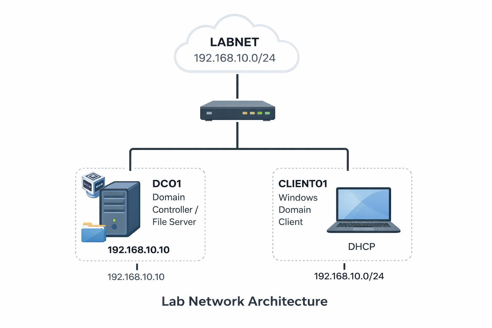
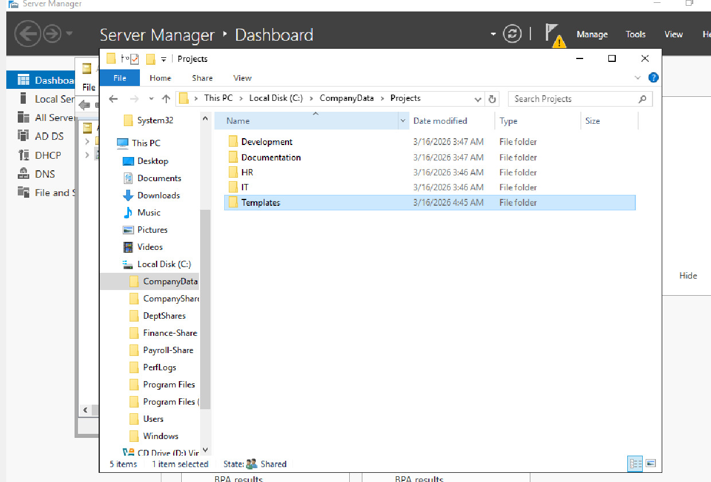
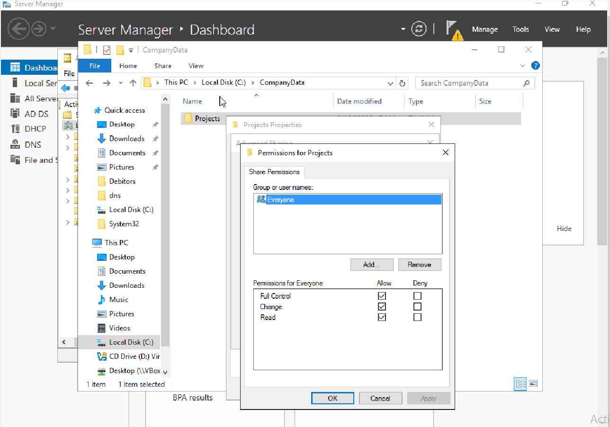
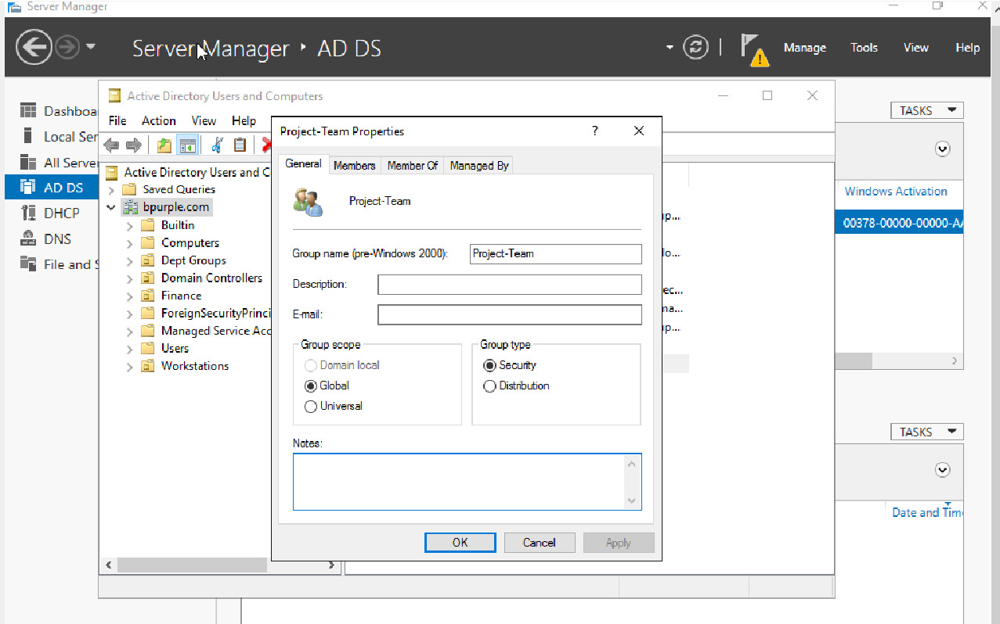
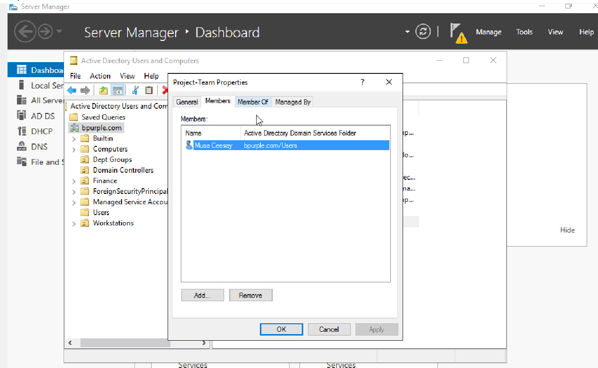
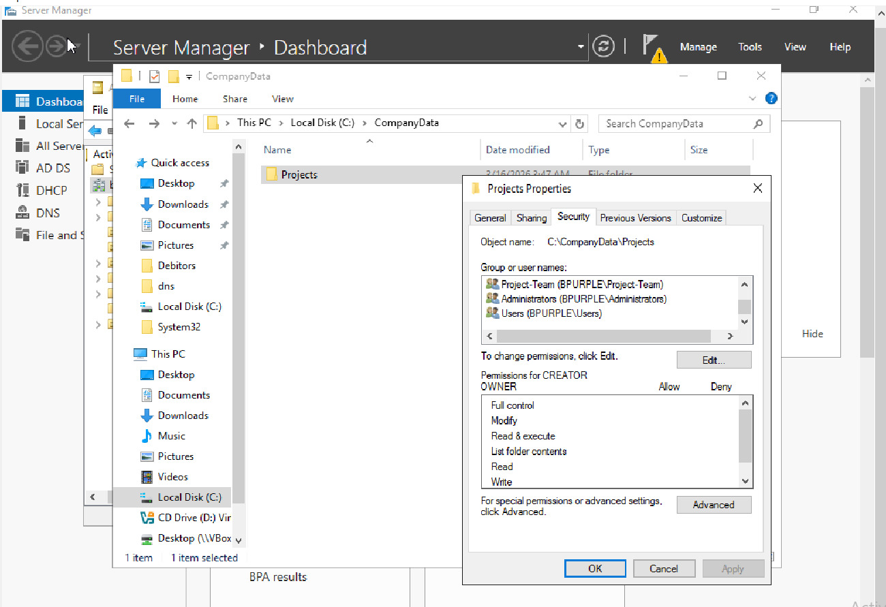
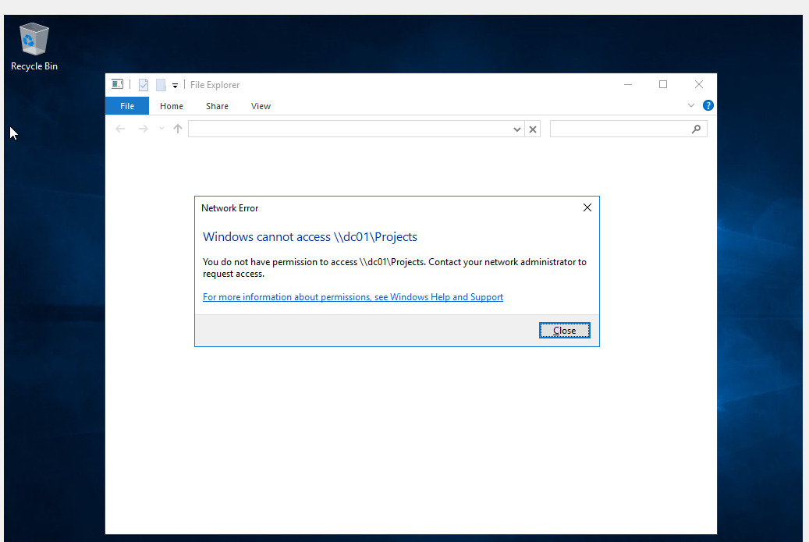
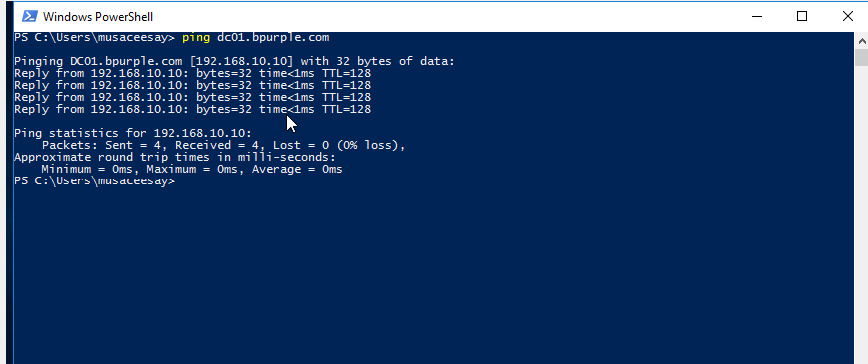
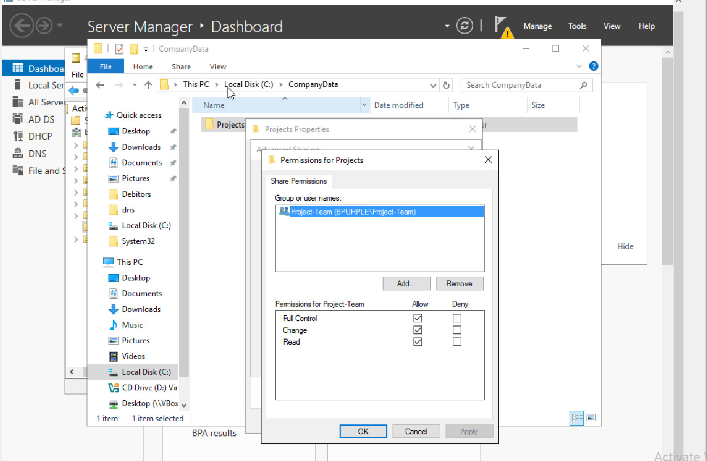
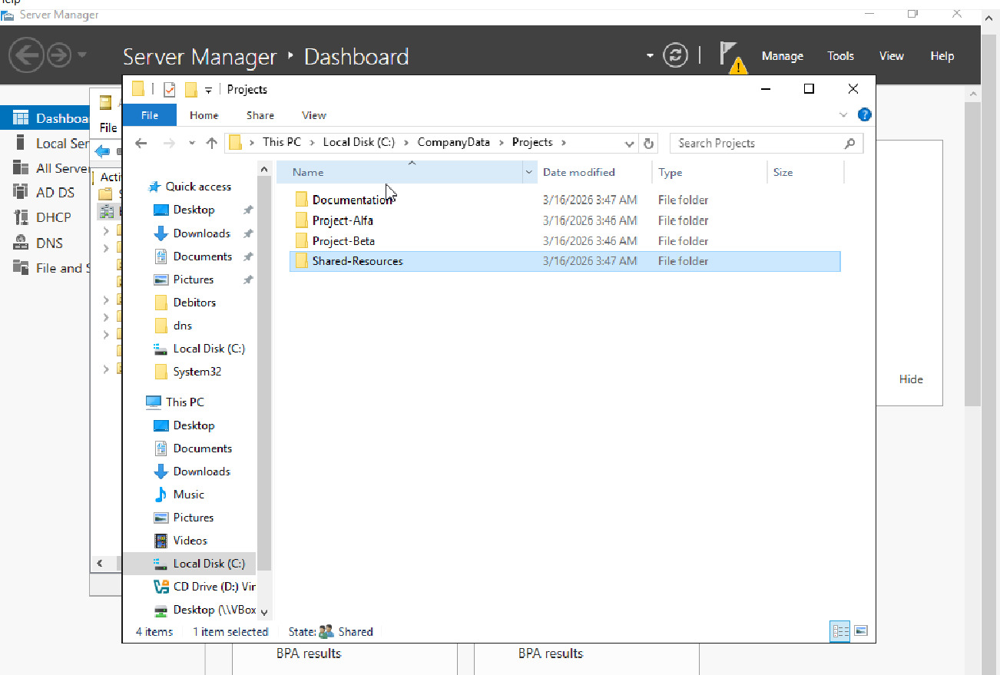

# Active Directory File Server Access Troubleshooting
## Enterprise Shared Folder Permissions Lab

This lab demonstrates how shared folder access is managed and troubleshooted in a Windows Active Directory environment using security groups and NTFS permissions.

The objective of this project is to simulate a real IT support incident where a user cannot access a shared network folder and document the investigation and resolution process.

This lab replicates common enterprise infrastructure scenarios where IT support engineers must troubleshoot file server permission issues caused by incorrect group membership or misconfigured NTFS permissions.

---

# Ticket Information

| Field | Value |
|------|------|
| Category | File Server / Access Management |
| Priority | P3 – Medium |
| Impact | User unable to access shared project files |
| SLA Target | 4 Hours |
| Resolution Time | ~45 Minutes |
| Status | Resolved |

---

# Scenario

## Incident Report

A user reported they could not access the company **Projects shared folder**.

In enterprise environments, shared resources such as department files, project documentation, and internal templates are typically stored on centralized file servers.

Access to these resources is controlled using:

- Active Directory security groups  
- NTFS permissions  
- Shared folder permissions  

The objective of this lab was to investigate and resolve a simulated incident where a user could not access a shared folder due to incorrect group membership.

---

# Environment

| System | Role | IP Address |
|------|------|------|
| DC01 | Domain Controller / File Server | 192.168.10.10 |
| CLIENT01 | Windows Domain Client | DHCP |

### Domain
bpurple.com

### Operating Systems
- Windows Server 2016 (Domain Controller)
- Windows 10 (Client Machine)

### Virtualization Platform
Oracle VirtualBox

### Network
Internal Network LABNET  
192.168.10.0/24

---

# Network Architecture

The diagram below illustrates the lab network topology.

- DC01 acts as both the Domain Controller and File Server  
- CLIENT01 is the domain joined workstation used to test access

---

# File Server Configuration

A shared folder was created on the Domain Controller to simulate a company file server used by employees to store and access project related files.

### Folder Path

C:\CompanyData\Projects

### Folder Structure

---

# Share Configuration

The folder was shared on the network using the UNC path:

\\dc01\Projects

### Initial Share Permissions

Initially the share allowed **Everyone** access.

In enterprise environments this configuration is typically replaced with group based access control.

---

# Security Group Configuration

To follow enterprise access control best practices, permissions were assigned to a security group instead of individual users.

Security Group: **Project-Team**

Users requiring access to the Projects folder are added to this group.

---

# Group Membership

The user **Musa Ceesay** was assigned to the Project-Team group.

This allows administrators to manage access centrally without modifying folder permissions for individual users.

---

# NTFS Permission Configuration

NTFS permissions were configured on the Projects folder.

| Group | Permission |
|------|------|
| SYSTEM | Full Control |
| Administrators | Full Control |
| Project-Team | Modify |
| CREATOR OWNER | Full Control |

Permission inheritance from the parent directory was disabled to ensure only authorized groups could access the folder.

---

# Simulated Incident

## Ticket Details

| Field | Value |
|------|------|
| Ticket ID | INC-1001 |
| User | musaceesay |
| Issue | Unable to access \\dc01\Projects |
| Category | File Server Access |
| Priority | Medium |

---

# Issue Reproduction

To simulate the incident, the user was removed from the Project-Team security group.

When the user attempted to access the shared folder from the client workstation:

\\dc01\Projects

Windows returned an **Access Denied error**.

---

# Investigation Process

The issue was investigated using a structured troubleshooting approach commonly used in enterprise IT environments.

## Step 1 — Verify Network Connectivity

The client machine was tested to ensure it could communicate with the domain controller.

Command executed:

ping dc01.bpurple.com

Result: Successful

This confirmed the issue was not related to network connectivity.

---

## Step 2 — Verify Shared Folder Access

The UNC path was tested again:

\\dc01\Projects

Result: Access Denied

This confirmed the issue was related to permissions.

---

## Step 3 — Check NTFS Permissions

The NTFS permissions on the Projects folder were reviewed.

Observation:  
Project-Team security group controls access to the folder.

---

## Step 4 — Review Group Membership

The user's group membership was reviewed in Active Directory.

Observation:  
User was not a member of the Project-Team security group.

Root cause identified.

---

# Root Cause

The user had been removed from the Project-Team security group, which provides access to the shared folder.

Since NTFS permissions were assigned to the group rather than the individual user, the user lost access to the folder.

---

# Resolution

The user was added back to the Project-Team security group.

Share permissions were verified to allow access for the group.

---

# Verification

After restoring group membership, the user logged back into the client workstation and attempted to access the shared folder again.

\\dc01\Projects

Result: Access Successful

The issue was resolved.

---

# Troubleshooting Summary

| Check | Purpose |
|------|------|
| ping dc01 | Verify network connectivity |
| \\dc01\Projects | Confirm shared folder access |
| NTFS permissions | Verify authorized groups |
| AD group membership | Identify missing permissions |

---

# Business Impact

Shared file systems are critical in enterprise environments for storing:

- internal documentation  
- project files  
- department resources  

Proper access management using Active Directory security groups and NTFS permissions ensures:

- controlled access to sensitive data  
- simplified permission management  
- improved security governance  
- reduced administrative overhead  

---

# Skills Demonstrated

- Active Directory user and group management
- Windows Server file server configuration
- NTFS permissions administration
- Shared folder configuration
- Access control troubleshooting
- Incident investigation
- Enterprise infrastructure management

---

# Key Takeaway

In enterprise IT environments, shared folder access should be controlled using Active Directory security groups rather than assigning permissions directly to individual users.

When troubleshooting access issues, administrators should verify:

1. Network connectivity  
2. Shared folder configuration  
3. NTFS permissions  
4. Security group membership  

Understanding these components is essential for resolving file server access issues.

---

# Conclusion

The file server was successfully configured within the bpurple.com Active Directory lab environment.

The Projects shared folder now provides controlled access using group based permissions, ensuring that only authorized users can access company project files.

This lab demonstrates a realistic enterprise IT support incident investigation and resolution process.