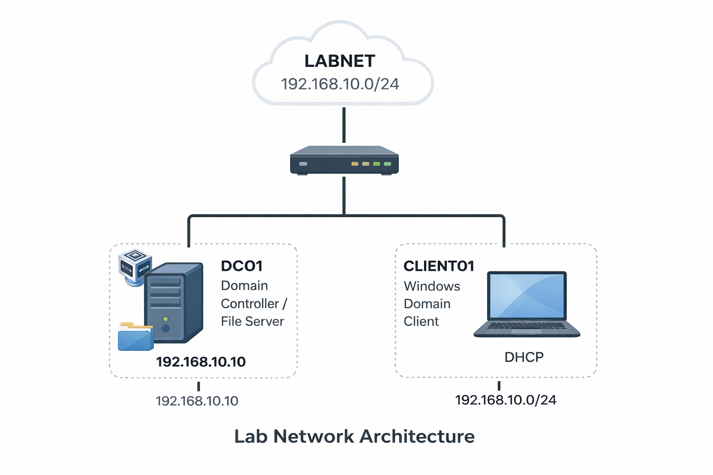
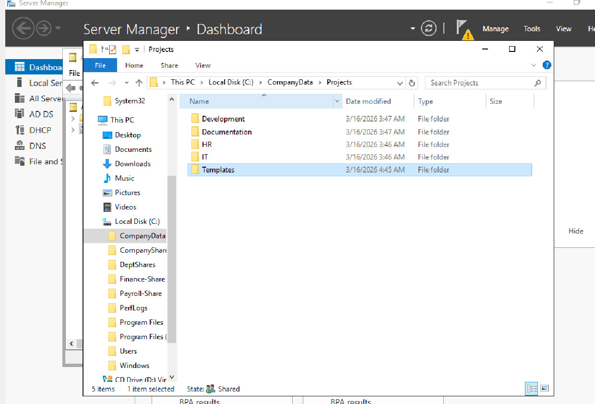
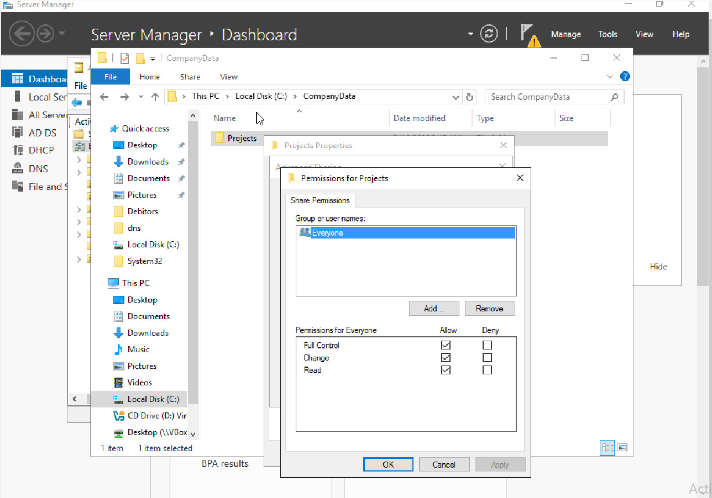
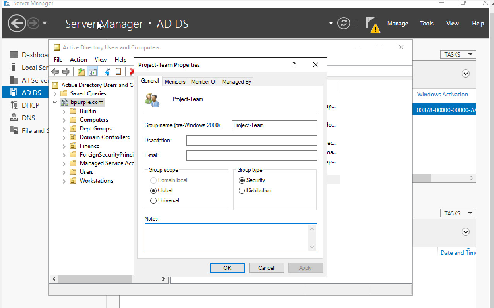
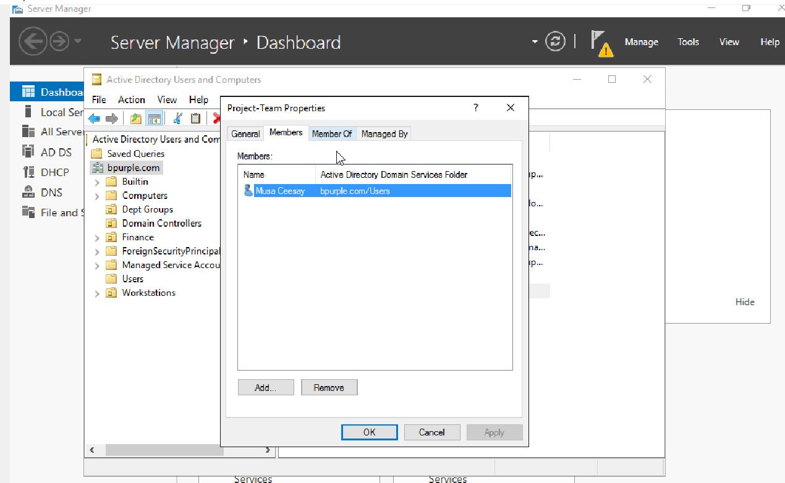
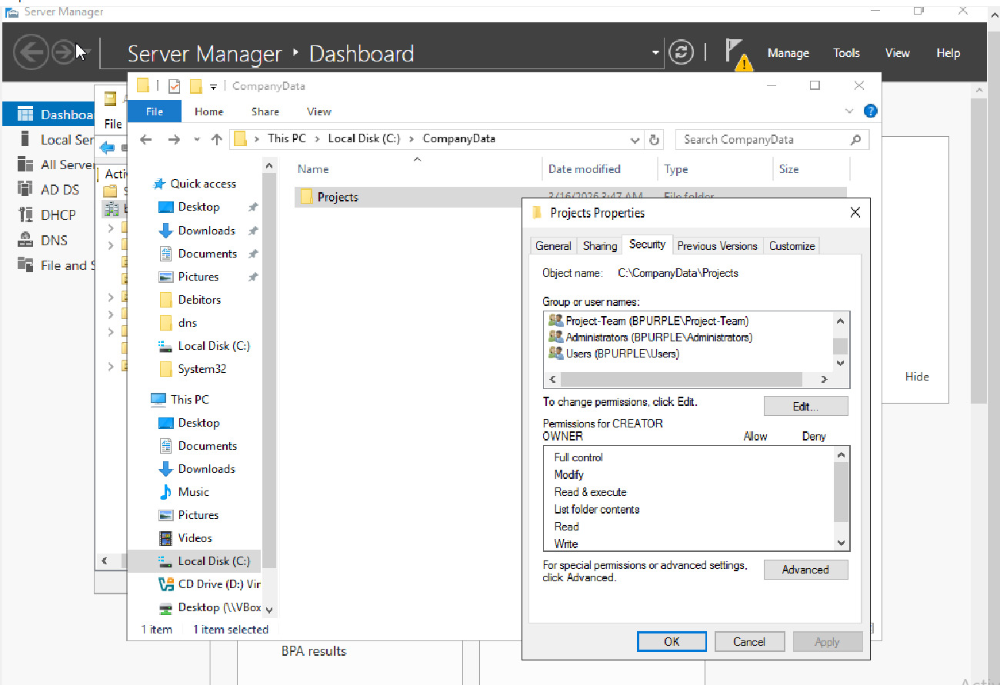
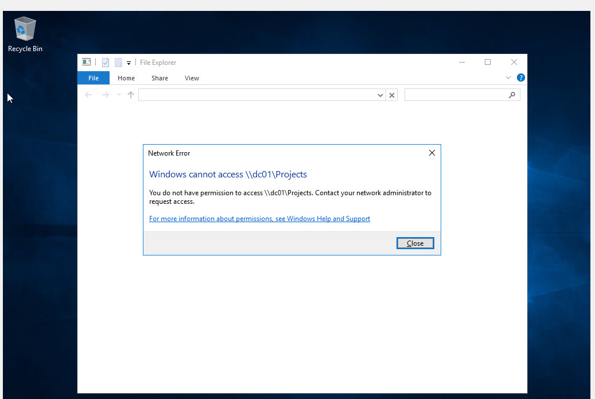
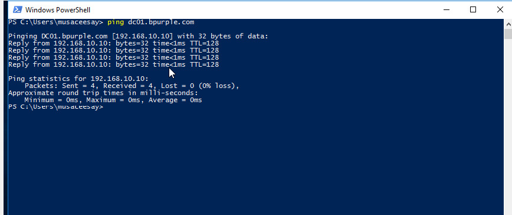
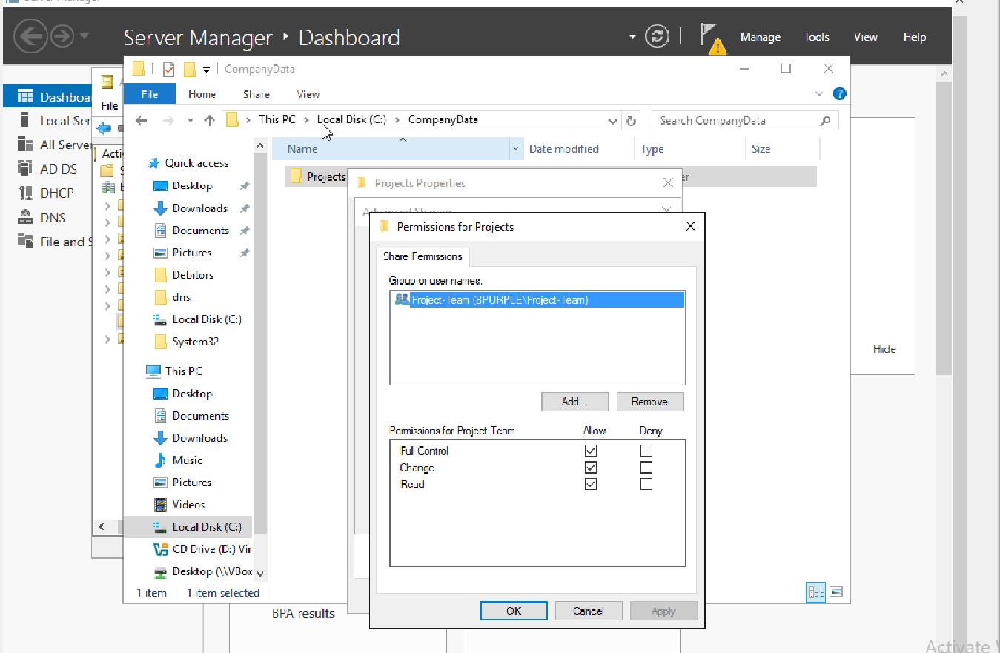
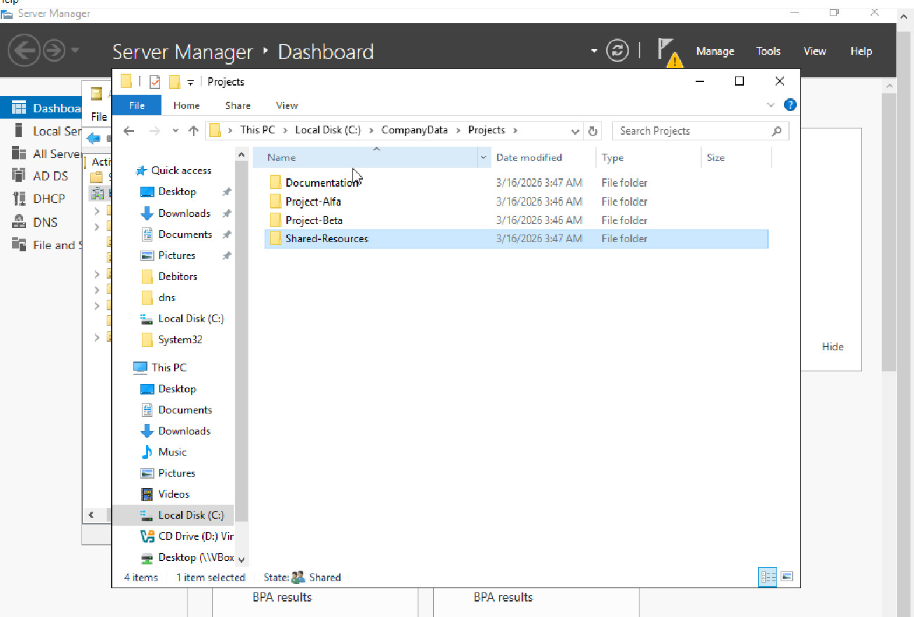

# Active Directory File Server Access Troubleshooting

## Enterprise Shared Folder Permissions Lab

In this lab, I worked through a shared folder access issue in an Active Directory environment.

The scenario simulates a common IT support ticket where a user is unable to access a shared project folder. I went through the issue step by step, checked the network connection, reviewed the permissions, checked the user's Active Directory group membership, and then restored the user's access.

The main goal was to get more comfortable with how Active Directory groups, share permissions, and NTFS permissions work together when managing access to shared resources.

---

# Ticket Information

| Field | Value |
|------|------|
| Category | File Server / Access Management |
| Priority | P3 – Medium |
| Impact | User unable to access shared project files |
| SLA Target | 4 Hours |
| Resolution Time | ~45 Minutes |
| Status | Resolved |

---

# Scenario

## Incident Report

I simulated a support request from a user who was unable to access the company Projects shared folder.

The folder is used to represent a shared company resource where employees can store and access project files.

Access to the folder is managed through an Active Directory security group and NTFS permissions.

The goal was to find out why the user was getting an **Access Denied** message and restore access without changing permissions unnecessarily.

---

# Environment

| System | Role | IP Address |
|------|------|------|
| DC01 | Domain Controller / File Server | 192.168.10.10 |
| CLIENT01 | Windows Domain Client | DHCP |

### Domain

`bpurple.com`

### Operating Systems

- Windows Server 2016
- Windows 10

### Virtualization Platform

Oracle VirtualBox

### Network

Internal Network: `LABNET`  
Network: `192.168.10.0/24`

---

# Network Architecture

The lab uses two main machines:

- **DC01** – Domain Controller and File Server
- **CLIENT01** – Windows client used to simulate the user's workstation



---

# File Server Configuration

I created a `Projects` folder on the server to simulate a company shared folder.

### Folder Path

`C:\CompanyData\Projects`

The folder contains several subfolders that represent different company resources.



---

# Share Configuration

The folder was shared so that it could be accessed from the client using the following UNC path:

`\\dc01\Projects`

### Initial Share Permissions

For the initial setup, the share was configured to allow **Everyone** access.



I then used Active Directory and NTFS permissions to control which users should actually have access to the folder.

---

# Security Group

Instead of assigning permissions directly to individual users, I created an Active Directory security group:

**Project-Team**



The idea was to manage access through the group rather than having to change folder permissions every time a user joins or leaves the project team.

---

# Group Membership

The test user, **Musa Ceesay**, was added to the `Project-Team` group.



This means that the user's access to the Projects folder is based on their membership in this group.

---

# NTFS Permissions

I configured NTFS permissions on the `Projects` folder.

The `Project-Team` group was given **Modify** access.

| Group | Permission |
|------|------|
| SYSTEM | Full Control |
| Administrators | Full Control |
| Project-Team | Modify |
| CREATOR OWNER | Full Control |



I also disabled permission inheritance from the parent folder so that the access settings for this folder could be controlled separately.

---

# Simulated Incident

## Ticket Details

| Field | Value |
|------|------|
| Ticket ID | INC-1001 |
| User | musaceesay |
| Issue | Unable to access `\\dc01\Projects` |
| Category | File Server Access |
| Priority | Medium |

---

# Issue Reproduction

To reproduce the problem, I removed the user from the `Project-Team` security group.

The user then tried to access:

`\\dc01\Projects`

Windows returned an **Access Denied** message.



At this point, I had a clear starting point for the investigation.

---

# Investigation

I followed a simple troubleshooting process rather than immediately changing permissions.

## Step 1 — Check Network Connectivity

First, I checked whether the client could communicate with the Domain Controller.

I used:

```powershell
ping dc01.bpurple.com
```



Result: Successful

This confirmed that the client could reach the server, so I could rule out a basic network connectivity problem.

---

## Step 2 — Verify Shared Folder Access

Next, I tried accessing the shared folder directly using the UNC path:

`\\dc01\Projects`

The result was **Access Denied**.

Since the server was reachable but access to the folder was being denied, I focused the investigation on permissions and access control.

---

## Step 3 — Check NTFS Permissions

I then checked the NTFS permissions on the `Projects` folder.

I noticed that access was controlled through the `Project-Team` security group rather than individual users.

---

## Step 4 — Review Group Membership

Finally, I reviewed the user's group membership in Active Directory.

I noticed the user was not part of the `Project-Team` group, which explained why access was denied.

This confirmed the root cause.

---

# Root Cause

The issue was caused by the user not being part of the `Project-Team` security group.

Since access to the folder was assigned through the group, removing the user from the group removed the access they needed.

---

# Resolution

To resolve the issue, I added the user back to the `Project-Team` security group.

I then checked the share and NTFS permissions again to make sure the configuration was still correct.



---

# Verification

After adding the user back to the group, I logged into the client machine again and tested access:

`\\dc01\Projects`



The user was able to open the shared folder successfully.

This confirmed that the issue had been resolved.

---

# Troubleshooting Summary

| Check | Purpose |
|---|---|
| `ping dc01.bpurple.com` | Verify network connectivity |
| `\\dc01\Projects` | Confirm shared folder access |
| NTFS permissions | Verify authorized groups |
| AD group membership | Identify missing permissions |

---

# Business Impact

In a real environment, an issue like this could prevent a user from accessing important project files and delay their work.

Using security groups instead of assigning permissions directly to individual users also makes access easier to manage, especially when users join or leave a team.

---

## Skills Demonstrated

- Managed Active Directory users and security groups to control access to shared resources
- Configured a Windows Server file share to simulate a company file server
- Applied and reviewed NTFS permissions to manage folder access
- Used security groups instead of individual users to simplify permission management
- Investigated and resolved an **Access Denied** issue using a structured troubleshooting approach
- Verified connectivity, permissions, and group membership to identify the root cause

---

# Key Takeaway

This lab helped me understand how Active Directory group membership and NTFS permissions work together when managing access to shared folders.

It also reinforced a troubleshooting process that I can use for similar support issues:

1. Check connectivity
2. Test access
3. Review permissions
4. Check group membership
5. Fix the issue
6. Verify the result

---

# Conclusion

In this lab, I investigated and resolved a shared folder access issue in an Active Directory environment.

The issue was caused by missing group membership, while the share and NTFS permissions were already configured for the appropriate access model.

Working through the scenario helped me better understand how file server access is managed through security groups and how to approach an Access Denied issue step by step.