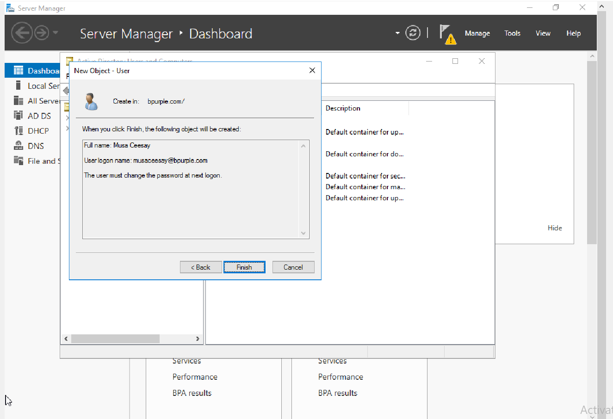
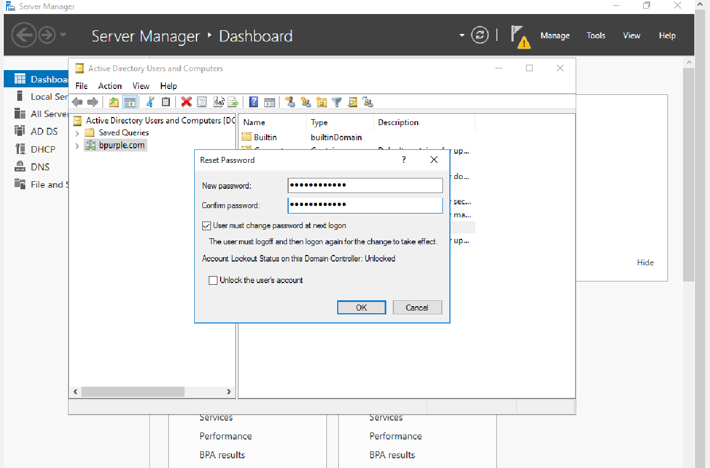
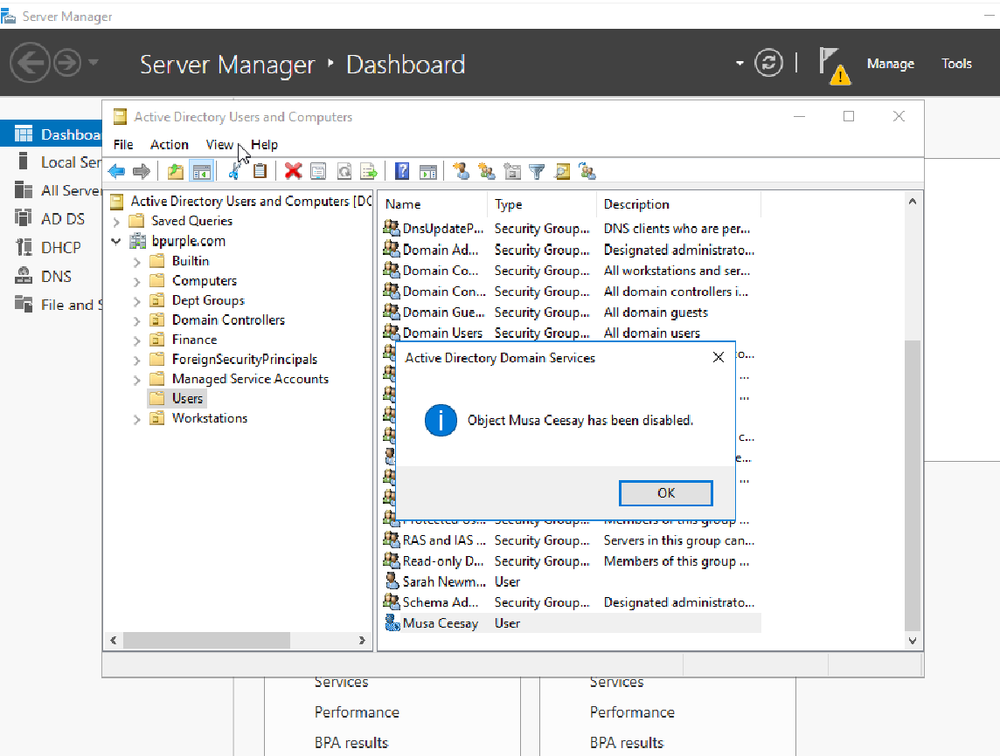
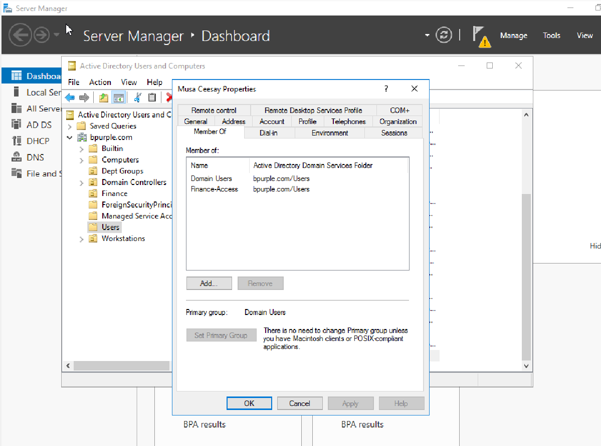

# Active Directory User Lifecycle Management – User Account Operations

This lab was performed in a simulated enterprise environment consisting of a Windows Server 2016 Domain Controller, a Windows client workstation, and an internal network infrastructure.

This lab demonstrates how IT administrators manage user identities within an Active Directory domain environment.  
It simulates common helpdesk tasks including user account creation, password reset, account disablement, and security group assignment.

These operations represent routine identity management responsibilities performed by IT support teams in enterprise environments.

---

# Ticket Information

- **Category:** Identity & Access Management / Active Directory  
- **Priority:** P3 – Medium  
- **Impact:** User authentication and access management  
- **SLA Target:** 4 Hours  
- **Resolution Time:** ~25 Minutes  
- **Status:** Completed  

---

# Scenario

**Task Assigned**

> Simulate the lifecycle management of a user account within an Active Directory domain environment.

In enterprise environments, IT administrators regularly manage user accounts to ensure that employees can securely access corporate systems and resources.

This lab demonstrates key Active Directory user management tasks including:

- Creating a user account
- Resetting user credentials
- Disabling a user account
- Assigning users to security groups

These actions simulate the onboarding, maintenance, and offboarding phases of identity lifecycle management.

---

# Environment

| System | Role | IP Address |
|------|------|------|
| DC01 | Domain Controller | 192.168.10.10 |
| CLIENT01 | Windows Client | DHCP |
| Domain | Active Directory | bpurple.com |

---

# Operating System

Windows Server 2016

---

# Tools Used

- Active Directory Users and Computers (ADUC)
- Server Manager
- Windows Server Administration Tools

---

# User Provisioning – Account Creation

A new user account was created within the Active Directory domain to simulate employee onboarding.

User information:

| Attribute | Value |
|------|------|
| Name | Musa Ceesay |
| Username | musaceesay |
| Domain | bpurple.com |

### Steps

1. Open **Active Directory Users and Computers**
2. Navigate to the domain container
3. Right-click the **Users** container
4. Select:
```
New → User
```


5. Enter the user information
6. Configure password settings
7. Complete the user creation wizard



This confirms that the user account **Musa Ceesay** was successfully created in Active Directory.

---

# Password Reset Operation

A password reset was performed to simulate a common helpdesk support request.

Example scenario:

> User forgot their password and requires a credential reset.

### Steps

1. Locate the user account in **Active Directory Users and Computers**
2. Right-click the user account
3. Select:
```
Reset Password
```

4. Enter a new password
5. Confirm the password change



The password reset operation completed successfully.

---

# Account Disable Operation

The user account was disabled to simulate employee offboarding or access revocation.

Example scenario:

> Employee has left the organization and account access must be disabled.

### Steps

1. Locate the user account
2. Right-click the user
3. Select:
```
Disable Account
```




The system confirms that the **Musa Ceesay user account was disabled**, preventing authentication access.

---

# Security Group Assignment

Access to enterprise resources is typically controlled through **security groups**.

In this lab, the user was assigned to a department security group.

Security group assigned:
Finance-Access


### Steps

1. Open **User Properties**
2. Navigate to the **Member Of** tab
3. Click **Add**
4. Add the group:
Finance-Access


5. Apply the configuration



This confirms that the user was successfully added to the **Finance-Access security group**.

Security groups allow administrators to control access to:

- shared folders
- network resources
- departmental systems

---

# Example Helpdesk Incident

**Ticket:** User Unable to Access Finance Shared Folder  

**Issue Reported:**  
User reported that they were unable to access the department finance shared folder.

**Investigation:**  
Investigation revealed that the user account was **not a member of the Finance-Access security group**, which controls access to the finance shared resources.

**Resolution:**

- Added user to **Finance-Access** security group
- User logged off and logged back in
- Access to finance shared resources restored

This scenario reflects a common **Active Directory access control issue handled by IT support teams.**

---

# User Account Lifecycle Workflow

Active Directory user accounts follow a structured lifecycle within enterprise environments.

This lifecycle ensures proper access provisioning, credential management, and access revocation.

| Lifecycle Stage | Action | Description |
|---|---|---|
| Provisioning | Create User | New employee account created in Active Directory |
| Access Assignment | Add to Security Group | User assigned appropriate department permissions |
| Credential Management | Reset Password | Helpdesk resets user authentication credentials |
| Access Revocation | Disable Account | User access revoked when employee leaves |

This workflow ensures organizations maintain secure identity management practices.

---

# Identity Lifecycle Model

User Creation  
↓  
Security Group Assignment  
↓  
Authentication & Daily Usage  
↓  
Password Management  
↓  
Account Disable / Offboarding

This model reflects the operational identity management processes used by enterprise IT teams.

---

# Validation

After completing the operations, the following checks were performed:

- Confirm user account exists in Active Directory
- Verify security group membership
- Confirm account disabled status

---

# Verification

The following validations were performed to confirm the operations:

| Validation | Result |
|------|------|
| User account creation | Successful |
| Password reset | Successful |
| Account disable operation | Successful |
| Security group assignment | Successful |

---

# Troubleshooting Notes

The following tools were used to validate configuration and user management operations:

| Tool | Purpose |
|------|------|
| Active Directory Users and Computers | Manage user accounts |
| User Properties | Verify security group membership |
| Reset Password Tool | Manage user credentials |

These tools are standard utilities used by IT administrators for identity management.

---

# Business Impact

Proper management of Active Directory user accounts is essential for maintaining secure access to enterprise systems.

Effective identity management ensures:

- secure authentication
- controlled access to company resources
- compliance with internal security policies

Failure to properly manage user accounts can lead to:

- unauthorized system access
- security vulnerabilities
- data exposure risks

---

# Skills Demonstrated

- Active Directory user management  
- Password reset procedures  
- Security group administration  
- Identity lifecycle management  
- Windows Server administration  
- Access control implementation  

---

# Key Takeaway

User identity management is one of the most common responsibilities of IT support teams.

Understanding how to properly perform:

- user creation
- password resets
- account disablement
- security group assignments

is essential for maintaining secure enterprise environments.

This lab demonstrates the importance of structured identity management in enterprise infrastructure.

Proper user lifecycle management ensures that:

- employees receive appropriate access when onboarded
- credentials can be securely managed through password resets
- access is revoked when employees leave the organization

Using **security groups for access control** simplifies permission management and improves the overall security posture of the organization.

---

# Conclusion

The Active Directory user lifecycle operations were successfully simulated within the **bpurple.com domain environment**.

This lab demonstrates the real-world identity management tasks commonly performed by IT support engineers and system administrators.

The exercise reinforces the importance of structured access management within enterprise infrastructure.
