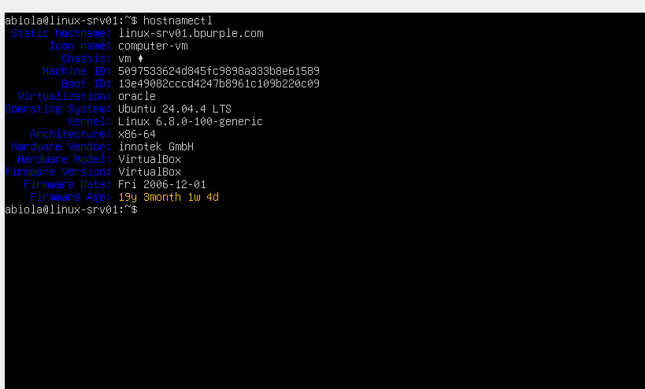
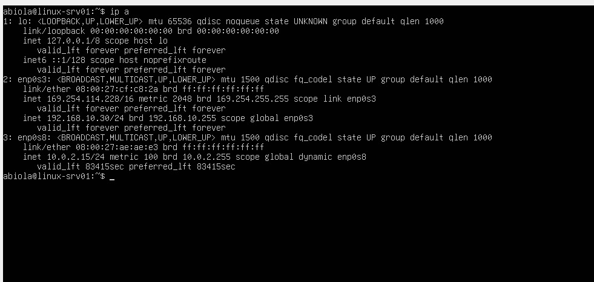
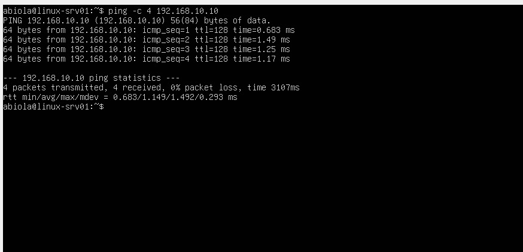
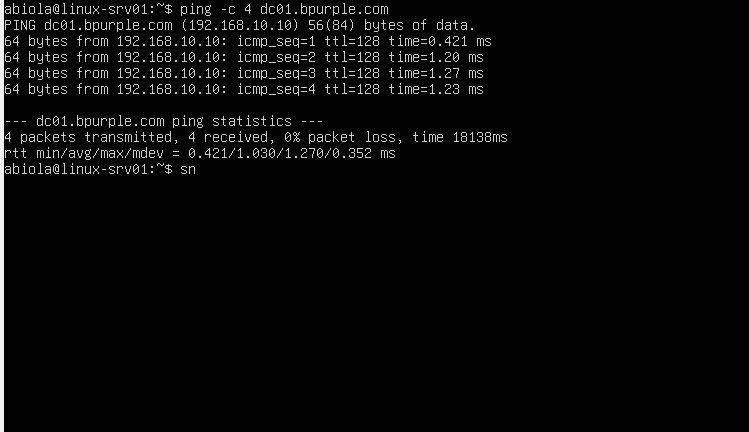

# Linux Server Integration – Active Directory Domain Environment

## Ticket Information

- **Category:** Linux Infrastructure / Identity Integration  
- **Priority:** P2 – High  
- **Impact:** Linux server integration into Active Directory environment  
- **SLA Target:** 1 Business Day  
- **Resolution Time:** ~2 hours  
- **Status:** Completed  

---

# Scenario

**Task Assigned**

> Integrate a Linux server into an existing Active Directory domain environment.

In many enterprise environments, Linux servers must authenticate against **Active Directory** for centralized identity management.

The objective of this lab was to deploy a Linux server and configure it to communicate with a **Windows Server Domain Controller** within an enterprise network.

The Linux system needed to:

- Connect to the internal enterprise network
- Use the Active Directory DNS server
- Resolve domain controller hostnames
- Communicate with the Domain Controller
- Prepare the system for domain authentication

This setup simulates real-world infrastructure where Linux servers interact with Windows Active Directory environments.

---

# Environment

| System | Role | IP Address |
|------|------|------|
| DC01 | Domain Controller | 192.168.10.10 |
| CLIENT01 | Windows Domain Client | DHCP |
| LINUX-SRV01 | Linux Server | 192.168.10.30 |

---

### Domain

bpurple.com

---

### Operating Systems

Domain Controller: Windows Server 2016  
Linux Server: Ubuntu Server 24.04 LTS  

---

### Virtualization Platform

Oracle VirtualBox

---

### Network

Internal Network (LABNET)  
Network Range: 192.168.10.0/24

---

# Network Architecture

This diagram illustrates the structure of the lab environment.

It shows the relationship between:

- **DC01** (Domain Controller)
- **CLIENT01** (Windows domain client)
- **LINUX-SRV01** (Linux server)

All systems communicate within the **192.168.10.0/24 LABNET internal network**.
---

# Linux Server Deployment

A Linux server virtual machine was deployed using **Ubuntu Server 24.04 LTS** inside Oracle VirtualBox.

The server was connected to the **LABNET internal network** to allow communication with the Domain Controller.

Hostname:

linux-srv01

---

# Network Configuration

IP Address

192.168.10.30

DNS Server

192.168.10.10

Verification command:

ip a

---

# DNS Configuration

To allow Linux to resolve the Active Directory domain, the DNS server was configured to point to the Domain Controller.

DNS Server:

192.168.10.10

Verification command:

cat /etc/resolv.conf

---

# Connectivity Validation

Network communication with the Domain Controller was tested.

Command:

ping 192.168.10.10

Result:

64 bytes from 192.168.10.10: icmp_seq=1 ttl=128 time=0.45 ms

This confirmed:

- Network connectivity
- Internal network communication
- Domain Controller accessibility

---

# Domain Name Resolution

The Linux server environment has been successfully prepared for
Active Directory authentication integration.

The server can communicate with the Domain Controller, resolve
domain resources through DNS, and participate in the enterprise
network infrastructure.

The environment is now ready for domain authentication using
Kerberos and SSSD.

Command:

ping dc01.bpurple.com

Result:

PING dc01.bpurple.com (192.168.10.10)

This confirms that the Linux system is correctly using the **Active Directory DNS service**.

---

# Domain Integration Preparation

The Linux system was prepared for Active Directory integration using the following packages:

- realmd
- sssd
- krb5-user
- adcli
- samba-common-bin
- oddjob
- oddjob-mkhomedir

These tools allow Linux systems to authenticate users through Active Directory.

---

# Verification

Linux server validation:

Hostname: linux-srv01  
IP Address: 192.168.10.30  
DNS Server: 192.168.10.10  

Connectivity test:

ping dc01.bpurple.com

Result:

Reply from 192.168.10.10

---

# Evidence — Lab Screenshots

These screenshots provide visual confirmation of the configuration steps and validation tests performed during the Linux server integration process.

---

## Linux Server Installation

This screenshot shows the deployed **Ubuntu Server 24.04 LTS virtual machine**.  
It confirms that the Linux server was successfully installed and configured with the hostname **linux-srv01**.

---

## Linux Server IP Address Configuration

The screenshot above shows the output of the command:
ip a

It confirms that the Linux server was assigned the correct static IP address **192.168.10.30** within the enterprise lab network.

---

## DNS Configuration

This screenshot shows the DNS configuration file verified using:
cat /etc/resolv.conf

It confirms that the Linux server is configured to use **192.168.10.10**, the Domain Controller, as its DNS server.

---

## Connectivity to Domain Controller

The screenshot displays the result of the connectivity test:
ping 192.168.10.10

Successful replies confirm that the Linux server can communicate with the **Domain Controller (DC01)** over the network.

---

## Domain Name Resolution

This screenshot shows the result of:
ping dc01.bpurple.com

The successful hostname resolution confirms that the Linux server is correctly using **Active Directory DNS services**.

---

## VirtualBox Network Configuration

The Linux virtual machine is connected to the **LABNET internal network**, allowing communication between:

- Domain Controller
- Windows Client
- Linux Server

---

# Business Impact

Linux and Windows environments often coexist in enterprise infrastructure.

Integrating Linux servers with Active Directory allows organizations to:

- Centralize authentication
- Manage user access from a single directory
- Improve security and identity governance
- Simplify system administration

---

# Skills Demonstrated

- Linux server deployment
- Enterprise network configuration
- DNS troubleshooting
- Windows–Linux interoperability
- Active Directory integration preparation
- Virtual infrastructure setup
- Network diagnostics
- Infrastructure documentation

---

# Key Takeaway

Enterprise environments rarely consist of a single operating system.

Understanding how **Linux systems interact with Active Directory environments** is a critical skill for system administrators and IT support engineers.

---

# Conclusion

The Linux server was successfully deployed within the **bpurple.com Active Directory lab environment**.

The server can now:

- Communicate with the Domain Controller
- Resolve domain resources using DNS
- Participate in enterprise network infrastructure

This lab prepares the environment for **future Linux Active Directory authentication integration** using Kerberos and SSSD.
