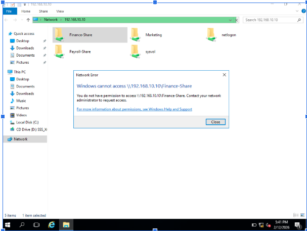
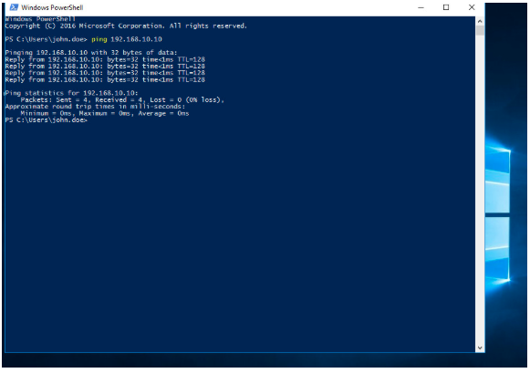
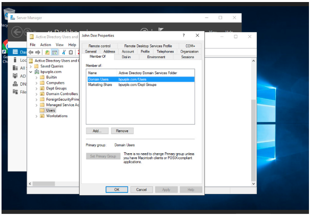
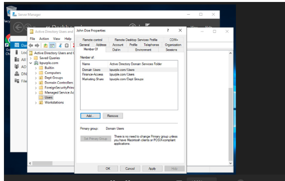
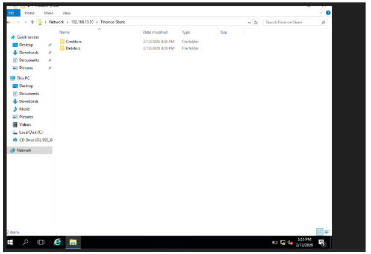

# File Server + NTFS Permission Lab – Shared Folder Access Denied

## Ticket Information

- **Category:** Windows Infrastructure / File Server / Active Directory  
- **Priority:** P3 – Medium  
- **Impact:** Single user unable to access shared department folder  
- **SLA Target:** 4 hours  
- **Resolution Time:** 50 minutes  
- **Status:** Resolved  

---

# Scenario

**User Reported:**

> “I can’t access the Finance shared folder.”

When attempting to open the shared network folder, the user received an **Access Denied** error message.

Other users in the department were able to access the folder successfully.

---

# Environment

- **Domain:** bpurple.com  
- **Domain Controller:** DC01 (192.168.10.10)  
- **Client Machine:** CLIENT01 (Domain Joined)  
- **Shared Folder:** \\DC01\Finance-Share  
- **Security Group:** Finance-Access  
- **Virtualization Platform:** Oracle VirtualBox  
- **Network Range:** 192.168.10.0 / 24  
- **DNS Server:** 192.168.10.10  

---

# Network Architecture


---

# Initial Symptoms

On the client machine (CLIENT01), the user attempted to access:

```
\\DC01\Finance-Share
```

Result:

```
Access Denied
```

The system displayed a permission error indicating that the user did not have access to the shared folder.



---

# Business Impact

Without access to the shared folder:

- Finance users cannot retrieve or store business documents  
- Department collaboration is interrupted  
- File-based workflows are delayed  
- IT support workload increases  

Although this issue affected only one user, it impacted access to important departmental resources.

---

# Investigation Steps

## Step 1 – Validate Network Connectivity

To confirm that the issue was not network-related, connectivity to the Domain Controller was tested.

Command executed:

```
ping 192.168.10.10
```

Result:

```
Reply from 192.168.10.10
```

This confirmed:

- Network connectivity was working
- The client could communicate with the server



---

## Step 2 – Validate Shared Folder Availability

Another domain user successfully accessed the folder.

This confirmed:

- The shared folder was available
- The file server was functioning correctly

The issue was isolated to **user authorization** rather than server availability.

---

## Step 3 – Review Share and NTFS Permissions

On **DC01**, the following permissions were reviewed:

**Share Permissions:**

Finance-Access — Modify

**NTFS Permissions:**

Finance-Access — Modify

Permissions were correctly configured using a **security group-based access model**.

This is considered best practice in enterprise environments.

---

## Step 4 – Verify User Group Membership

Opened:

Active Directory Users and Computers

Located the user account:

john

Checked group membership.

The user **was not a member of the Finance-Access security group**.



---

# Root Cause

The user account was **not included in the security group assigned to the shared folder permissions**.

Since both **Share Permissions and NTFS Permissions were assigned to the Finance-Access group**, access was denied to any user outside this group.

The permission system was functioning correctly.

---

# Resolution Steps

1. Opened **Active Directory Users and Computers**  
2. Located the **Finance-Access security group**  
3. Added the user account:

john

4. Applied and saved the changes.



---

# Verification

The user logged out and logged back into the workstation to refresh the Kerberos authentication token.

The user then accessed:

```
\\DC01\Finance-Share
```

Result:

The folder opened successfully.



Access to the shared folder was fully restored.

---

# Skills Demonstrated

- Windows File Server management  
- NTFS permission configuration  
- Share permission configuration  
- Active Directory security group management  
- Group-based access control (RBAC)  
- Troubleshooting access permission issues  
- Network connectivity validation  
- Enterprise incident documentation  

---

# Key Takeaway

In enterprise environments, **permissions should always be assigned to security groups rather than individual users**.

This approach provides:

- centralized access management
- simplified permission administration
- scalable user access control

When troubleshooting file access issues, the recommended workflow is:

1. Validate network connectivity  
2. Confirm server and share availability  
3. Review share permissions  
4. Review NTFS permissions  
5. Verify user group membership  

Following this structured process ensures efficient and accurate issue resolution.

---

# Conclusion

The issue was caused by the user not being a member of the **Finance-Access security group**, which controlled access to the shared folder.

Once the user was added to the correct security group and re-authenticated, access to the shared resource was restored.

This lab demonstrates a common **real-world file server permission issue handled by IT support and system administrators in enterprise environments.**
